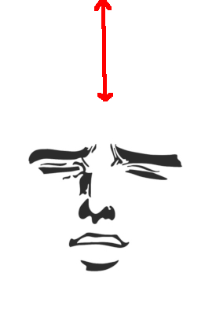

# Hauteur Yà Change Zimage

Un script (avec un nom à la con - merci **TheLuxe**, j'étais pas inspiré) qui ajoute une zone vide au début de l'image. :warning: Il remplace directement, aucune copie n'est éffectuée.

## Démonstration

Ajout de **128** pixels de vide au dessus de l'image.

| Originale                    |                                 |
| ---------------------------- | ------------------------------- |
|  |  |


## Utilisation

```sh
python main.py emplacement_de_limage nombre_de_pixels
```

